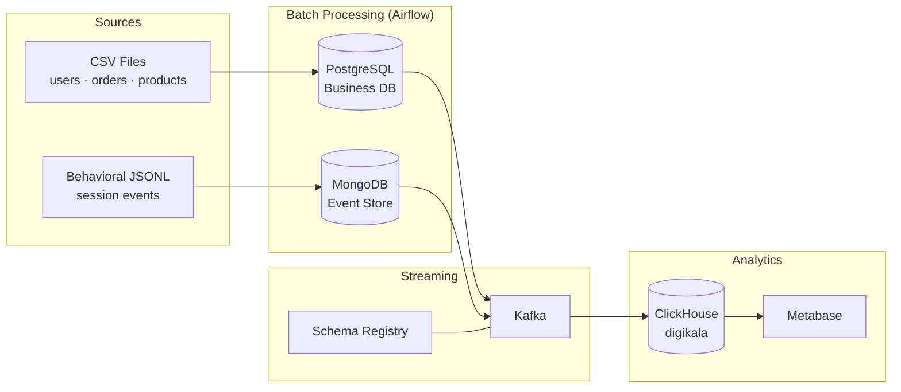

# Online Store Data Pipeline

An end-to-end data engineering pipeline for an e-commerce platform. The project ingests transactional CSV data and behavioral session events, orchestrates batch and streaming workflows with Apache Airflow, and lands analytics-ready datasets in ClickHouse for BI reporting with Metabase.

The domain model is inspired by an online retail store (Digikala-style): users, products, orders, and a full behavioral event funnel from page views through purchase completion.

---

## Table of Contents

- [Architecture](#architecture)
- [Features](#features)
- [Tech Stack](#tech-stack)
- [Project Structure](#project-structure)
- [Prerequisites](#prerequisites)
- [Getting Started](#getting-started)
- [Environment Variables](#environment-variables)
- [Services and Ports](#services-and-ports)
- [Airflow Connections](#airflow-connections)
- [Pipeline Overview](#pipeline-overview)
- [Airflow DAGs](#airflow-dags)
- [ClickHouse Analytics Layer](#clickhouse-analytics-layer)
- [Operational Notes](#operational-notes)

---

## Architecture



**High-level flow**

1. **Transactional data** — CSV files are cleaned, validated, and upserted into PostgreSQL.
2. **Behavioral data** — JSONL session files are parsed, transformed, and stored in MongoDB collections by event type.
3. **Streaming** — PostgreSQL and MongoDB records are published to Kafka (JSON Schema for transactional data, Avro for behavioral events).
4. **Analytics** — ClickHouse consumes Kafka topics via Kafka engine tables and materialized views.
5. **Reporting** — Pre-aggregated ClickHouse tables power Metabase dashboards.

---

## Features

- **Transactional ETL** — Incremental CSV loading with file change detection and idempotent upserts
- **Behavioral event ingestion** — 10 event types with schema validation and safe type casting
- **Change-data style publishing** — Cursor-based incremental export from PostgreSQL and MongoDB to Kafka
- **Schema governance** — Confluent Schema Registry for JSON Schema (Postgres) and Avro (MongoDB events)
- **Real-time analytics landing** — ClickHouse Kafka engine tables with materialized views
- **Pre-built reports** — Sales performance, product ranking, conversion funnel, and geo/loyalty segmentation
- **Full observability stack** — Airflow UI, Kafka UI, Adminer, and optional Celery Flower

---

## Tech Stack

| Layer | Technology |
|-------|------------|
| Orchestration | Apache Airflow 3.2.1 (CeleryExecutor) |
| Transactional DB | PostgreSQL 16 |
| Document Store | MongoDB 7.0 |
| Message Broker | Apache Kafka 4.2.0 |
| Schema Registry | Confluent Schema Registry 8.2.0 |
| Stream Connect | Kafka Connect 8.2.0 |
| Analytics DB | ClickHouse |
| BI | Metabase |
| Runtime | Docker Compose |

---

## Project Structure

```
online_store_data_pipeline/
├── docker-compose.yml          # Full infrastructure stack
├── sql/
│   ├── init_postgres.sql       # PostgreSQL DDL (reference)
│   ├── tables.sql              # ClickHouse core + Kafka tables (Postgres topics)
│   ├── events.sql              # ClickHouse Kafka tables + MVs (behavioral events)
│   ├── mv.sql                  # ClickHouse MVs for users/products/orders
│   ├── sales-report.sql        # Daily sales performance report
│   ├── Top-Products.sql        # Top products by add-to-cart revenue
│   ├── User-Behavior-Funnel.sql
│   └── geo_loyalty_segmentation_report.sql
└── workflow/
    ├── dags/                   # Airflow DAG definitions
    ├── tasks/                  # Python task implementations
    └── utils/                  # Shared constants and casting helpers
```

Persistent data directories (`data/postgres`, `data/mongodb`, `data/kafka`, `data/clickhouse`) and runtime logs are gitignored and created at deploy time.

---

## Prerequisites

- Docker and Docker Compose
- At least **4 GB RAM**, **2 CPUs**, and **10 GB disk** (Airflow requirement)
- Linux: set `AIRFLOW_UID` in `.env` to your host user ID to avoid permission issues
- External Docker network `traefik_traefik_network` if using Traefik routing labels (optional for local development)

---

## Getting Started

### 1. Configure environment

Create a `.env` file in the project root. See [Environment Variables](#environment-variables) for the full list.

On Linux, export your user ID:

```bash
echo "AIRFLOW_UID=$(id -u)" >> .env
```

Generate Airflow secrets:

```bash
python -c "from cryptography.fernet import Fernet; print(FERNET_KEY=$(Fernet.generate_key().decode()))"
```

### 2. Prepare data directories

```bash
mkdir -p data/postgres data/mongodb data/kafka data/clickhouse
mkdir -p workflow/logs workflow/config workflow/plugins
```

Place source CSV files in the Airflow data mount (configured in `docker-compose.yml` as `/opt/airflow/data`):

- `users.csv`
- `products.csv`
- `orders.csv`

Place behavioral JSONL files in the behavioral data mount (`/opt/airflow/behavioral-data` or `/opt/airflow/data/behavioral`, depending on the DAG version).

### 3. Start the stack

```bash
docker compose up -d
```

Wait for all health checks to pass, then open the Airflow UI at [http://localhost:8080](http://localhost:8080) (default credentials: `airflow` / `airflow`).

### 4. Bootstrap the pipeline

Run DAGs in this order:

| Step | DAG | Schedule | Description |
|------|-----|----------|-------------|
| 1 | `postgres_schema_setup` | Once | Create PostgreSQL enums and tables |
| 2 | `csv_etl_pipeline` | Daily | Load CSV data into PostgreSQL |
| 3 | `process_new_files_to_mongodb` or `process_daily_behavioral_json_to_mongodb` | Daily | Ingest behavioral JSONL into MongoDB |
| 4 | `postgres_to_kafka_batch_publish` | Manual | Stream transactional data to Kafka |
| 5 | `mongo_to_kafka_batch_publish` | Manual | Stream behavioral events to Kafka |

### 5. Initialize ClickHouse

Connect to ClickHouse and run the SQL scripts in order:

```bash
# Example using clickhouse-client inside the container
docker exec -it clickhouse clickhouse-client --multiquery < sql/tables.sql
docker exec -it clickhouse clickhouse-client --multiquery < sql/mv.sql
docker exec -it clickhouse clickhouse-client --multiquery < sql/events.sql
docker exec -it clickhouse clickhouse-client --multiquery < sql/sales-report.sql
docker exec -it clickhouse clickhouse-client --multiquery < sql/Top-Products.sql
docker exec -it clickhouse clickhouse-client --multiquery < sql/User-Behavior-Funnel.sql
docker exec -it clickhouse clickhouse-client --multiquery < sql/geo_loyalty_segmentation_report.sql
```

### 6. Connect Metabase

Open [http://localhost:3000](http://localhost:3000), complete setup, and add ClickHouse as a data source using the credentials from your `.env` file. Sample Metabase queries are included as comments in the report SQL files under `sql/`.

---

## Environment Variables

Create a `.env` file with the following variables:

| Variable | Description |
|----------|-------------|
| `AIRFLOW_UID` | Host user ID for Airflow file permissions (Linux) |
| `FERNET_KEY` | Airflow Fernet encryption key |
| `AIRFLOW_JWT_SECRET` | JWT secret for Airflow API auth |
| `AIRFLOW_ISSUE` | JWT issuer for Airflow API auth |
| `AF_POSTGES_USER` | Airflow metadata DB username |
| `AF_POSTGRES_PASSWORD` | Airflow metadata DB password |
| `AF_POSTGRES_DB` | Airflow metadata DB name |
| `POSTGRES_BS_USER` | Business PostgreSQL username and password |
| `POSTGRES_BS_DB` | Business PostgreSQL database name |
| `MONGO_USERNAME` | MongoDB root username |
| `MONGO_PASSWORD` | MongoDB root password |
| `SCHEMAREG_LISTENERS` | Schema Registry listener URL (e.g. `http://0.0.0.0:8081`) |
| `CLICKHOUSE_DB` | ClickHouse database name |
| `CLICKHOUSE_USER` | ClickHouse username |
| `CLICKHOUSE_PASSWORD` | ClickHouse password |
| `MB_DB_USER` | Metabase application DB user |
| `MB_DB_PASS` | Metabase application DB password |
| `MB_DB_HOST` | Metabase application DB host |
| `MB_POSTGRES_USER` | Metabase metadata Postgres user |
| `MB_POSTGRES_PASSWORD` | Metabase metadata Postgres password |
| `MB_POSTGRES_DB` | Metabase metadata Postgres database |

Optional:

| Variable | Default | Description |
|----------|---------|-------------|
| `AIRFLOW_IMAGE_NAME` | `docker.arvancloud.ir/apache/airflow:3.2.1` | Airflow Docker image |
| `ENV_FILE_PATH` | `.env` | Path to environment file |
| `_AIRFLOW_WWW_USER_USERNAME` | `airflow` | Airflow web UI username |
| `_AIRFLOW_WWW_USER_PASSWORD` | `airflow` | Airflow web UI password |

---

## Services and Ports

| Service | Port | URL / Access |
|---------|------|--------------|
| Airflow API / UI | 8080 | http://localhost:8080 |
| Business PostgreSQL | 5433 | `localhost:5433` |
| Adminer | 8182 | http://localhost:8182 |
| MongoDB | 27017 | `localhost:27017` |
| Kafka (external) | 19092 | `localhost:19092` |
| Schema Registry | 8081 | http://localhost:8081 |
| Kafka Connect | 8083 | http://localhost:8083 |
| Kafka UI | 8085 | http://localhost:8085 |
| ClickHouse HTTP | 8123 | http://localhost:8123 |
| ClickHouse native | 9000 | `localhost:9000` |
| Metabase | 3000 | http://localhost:3000 |
| Celery Flower (profile) | 5555 | http://localhost:5555 |

Traefik routes are configured for production deployment:

- Airflow: `airflow.group5.querabootcamp-de.ir`
- Kafka UI: `ku.group5.querabootcamp-de.ir`
- Metabase: `mb.group5.querabootcamp-de.ir`

---

## Airflow Connections

Configure these connections in the Airflow UI (**Admin → Connections**):

| Connection ID | Type | Usage |
|---------------|------|-------|
| `postgres_business` | Postgres | CSV ETL, schema setup, Kafka publish |
| `mongo_test` | Mongo | Behavioral ingestion and Kafka publish |
| `fs_default` | Filesystem | File sensor for daily behavioral DAG v2 |
| `mongo_test` (FS) | Filesystem | File sensor for behavioral DAG v1 |

---

## Pipeline Overview

### Transactional path

```
CSV → clean/transform → PostgreSQL → Kafka (JSON Schema) → ClickHouse
```

- **Cleaning** — Column normalization, enum mapping (loyalty tier, category, payment method), deduplication
- **Loading** — Upsert via `INSERT ... ON CONFLICT DO UPDATE`
- **Publishing** — Batched export ordered by numeric ID suffix; progress tracked in Airflow Variables

**Kafka topics**

| Topic | Source Table |
|-------|--------------|
| `postgres.users` | `users` |
| `postgres.products` | `products` |
| `postgres.orders` | `orders` |

### Behavioral path

```
JSONL → validate/transform → MongoDB → Kafka (Avro) → ClickHouse
```

**Supported event types**

| Event Type | MongoDB Collection | Kafka Topic |
|------------|-------------------|-------------|
| `page_view` | `page_view` | `events.page_view` |
| `product_search` | `product_search` | `events.search` |
| `add_to_cart` | `add_to_cart` | `events.add_to_cart` |
| `remove_from_cart` | `remove_from_cart` | `events.remove_from_cart` |
| `cart_view` | `cart_view` | `events.cart_view` |
| `checkout_start` | `checkout_start` | `events.checkout` |
| `payment_attempt` | `payment_attempt` | `events.payment` |
| `order_complete` | `order_complete` | `events.order` |
| `review_submit` | `review_submit` | `events.review` |
| `wishlist_add` | `wishlist_add` | `events.wishlist` |

Each JSONL record must include: `timestamp`, `user_id`, `session_id`, `event_type`, and `device`.

---

## Airflow DAGs

### `postgres_schema_setup`

- **Schedule:** `@once`
- **Purpose:** Creates PostgreSQL enums and tables (`users`, `products`, `orders`)

### `csv_etl_pipeline`

- **Schedule:** `@daily`
- **Purpose:** Loads `users.csv`, `orders.csv`, and `products.csv` when file modification time changes
- **State:** Tracks last processed mtime per file in Airflow Variables

### `process_new_files_to_mongodb`

- **Schedule:** `@daily`
- **Purpose:** Watches `/opt/airflow/behavioral-data/*.json`, skips already-processed files (tracked in MongoDB `state` collection)

### `process_daily_behavioral_json_to_mongodb`

- **Schedule:** `@daily`
- **Purpose:** Processes date-partitioned files matching `session_{YYYYMMDD}_*.json`

### `postgres_to_kafka_batch_publish`

- **Schedule:** Manual
- **Purpose:** Publishes new PostgreSQL records to Kafka with JSON Schema serialization

### `mongo_to_kafka_batch_publish`

- **Schedule:** Manual
- **Purpose:** Publishes new MongoDB event documents to Kafka with Avro serialization

---

## ClickHouse Analytics Layer

All analytics objects live in the `digikala` database.

### Core tables

| Table | Engine | Source |
|-------|--------|--------|
| `users`, `products`, `orders` | ReplacingMergeTree | Kafka topics `postgres.*` |
| `page_view`, `product_search`, … | ReplacingMergeTree | Kafka topics `events.*` |

### Pre-built reports

| Report Table | Metrics |
|--------------|---------|
| `sales_performance_daily_report` | Daily order count, revenue, purchasing users |
| `top_products_report` | Top products by add-to-cart quantity and estimated revenue |
| `user_behavior_funnel_daily_report` | Search → view → cart → checkout → purchase funnel |
| `user_loyalty_segment_report` | User counts by location and loyalty tier |

Report tables use `SummingMergeTree` and are populated automatically via materialized views. Example Metabase queries are documented in the corresponding SQL files under `sql/`.

---

## Operational Notes

- **DAGs are paused at creation** — Unpause each DAG in the Airflow UI before running.
- **Incremental Kafka publishing** — Progress is stored in Airflow Variables (`postgres_to_kafka_{table}_last_id`, `mongo_to_kafka_{event_type}_last_id`). Reset a variable to re-publish from the beginning.
- **PostgreSQL logical replication** — Business Postgres runs with `wal_level=logical` for potential CDC use cases.
- **Duplicate behavioral events** — MongoDB collections enforce a unique index on `(timestamp, session_id)`.
- **Volume mounts** — `docker-compose.yml` references host paths under `/home/deuser/` for bootcamp deployment. Adjust these mounts for local development.
- **Optional profiles** — Use `docker compose --profile debug up` for the Airflow CLI, or `--profile flower` for Celery Flower monitoring.

---

## Data Model (PostgreSQL)

### `users`

| Column | Type | Notes |
|--------|------|-------|
| `user_id` | VARCHAR(50) PK | |
| `name` | TEXT | Required |
| `email` | TEXT | Unique |
| `signup_date` | TIMESTAMP | |
| `device` | VARCHAR(50) | desktop, mobile, tablet |
| `loyalty_tier` | ENUM | Bronze, Silver, Gold |
| `location` | TEXT | |

### `products`

| Column | Type | Notes |
|--------|------|-------|
| `product_id` | VARCHAR(50) PK | |
| `name` | TEXT | Required |
| `price` | NUMERIC(10,2) | |
| `category` | ENUM | Beauty, Clothing, Electronics, Home, Other |
| `inventory` | INTEGER | |
| `popularity_score` | FLOAT | |

### `orders`

| Column | Type | Notes |
|--------|------|-------|
| `order_id` | VARCHAR(50) PK | |
| `user_id` | VARCHAR(50) FK | References `users` |
| `created_at` | TIMESTAMP | |
| `total` | NUMERIC(10,2) | |
| `status` | ENUM | completed |
| `payment_method` | ENUM | credit_card, apple_pay, google_pay, paypal |

---

## License

This project was built as part of the Quera Data Engineering Bootcamp (Team 5).
